# EduHub

  <a href="https://eduhub.alphabot.vn/">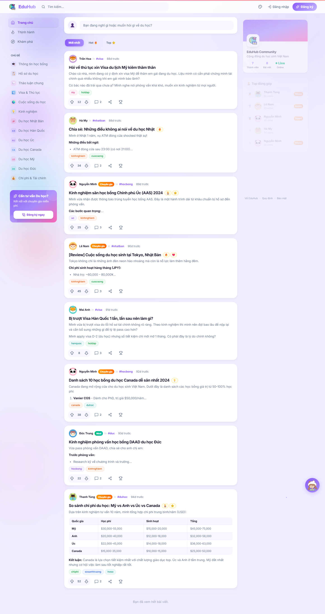</a>

  <strong>A study-abroad community platform that combines trust-building content, AI assistance, and an operator-side admin system.</strong>

  EduHub gives students and parents a calmer, more credible way to explore study-abroad questions
  before they ever move into a direct consulting conversation.

  
  
  
  

  <strong>Read in English</strong> |
  <a href="README.vi.md"><strong>Đọc bằng tiếng Việt</strong></a>

  <a href="https://eduhub.alphabot.vn/"><strong>Live Site</strong></a>
  |
  <a href="https://eduhub.alphabot.vn/admin"><strong>Admin Surface</strong></a>
  |
  <a href="SUPPORT.md"><strong>Support</strong></a>
  |
  <a href="docs/FAQ.md"><strong>FAQ</strong></a>

## The Big Shift

Many study-abroad websites still push users into sales too early:

- They ask for contact details before trust is built.
- They present scattered information without context.
- They create pressure before the user is ready.
- They lose credibility before a real advisory conversation begins.

EduHub changes that journey.

Users can browse community posts, search existing questions, read real experiences, and use the AI layer for quick guidance. On the operator side, the same product connects that public discovery flow to moderation, content control, and lead handling.

> From fragmented study-abroad questions to a guided community and admin workflow in one system.

This repository is a public product-information and support hub for the live EduHub product. It does not contain the application source code.

## What You Get

- A public community feed for study-abroad questions, answers, and shared experiences.
- Topic-led exploration across visas, scholarships, countries, schools, and student life.
- An AI assistance layer for quick answers and consultation handoff.
- A signed-in member experience for posting, reacting, and participating more deeply.
- Public post-detail and comment-thread views that make real discussion visible instead of hiding it behind forms.
- Member profile pages that turn anonymous traffic into recognizable contributors and community trust signals.
- An admin system for dashboard review, post moderation, users, topics, AI knowledge base control, settings, leads, and operational handling.

## At A Glance

- Hosted Web Platform.
- Community And AI Product Model.
- Built For Students, Parents, And Education Operators.
- Public Discovery Flow With Logged-In Participation.
- Admin Surface For Moderation And Operations.
- Closed-Source Commercial Deployment.

## Visual Tour

### Public Experience

  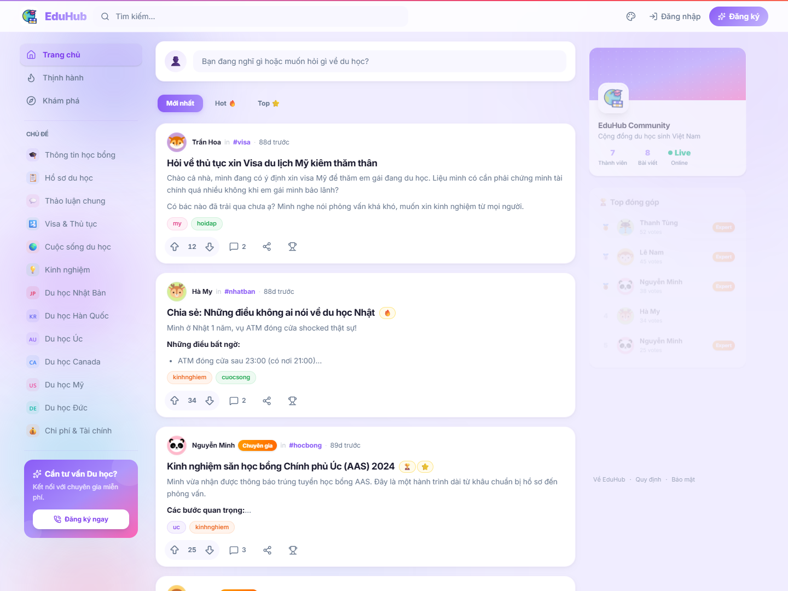
  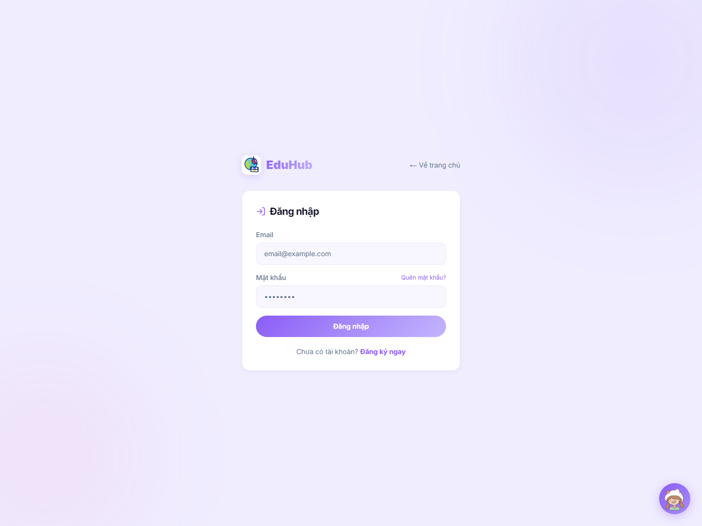
  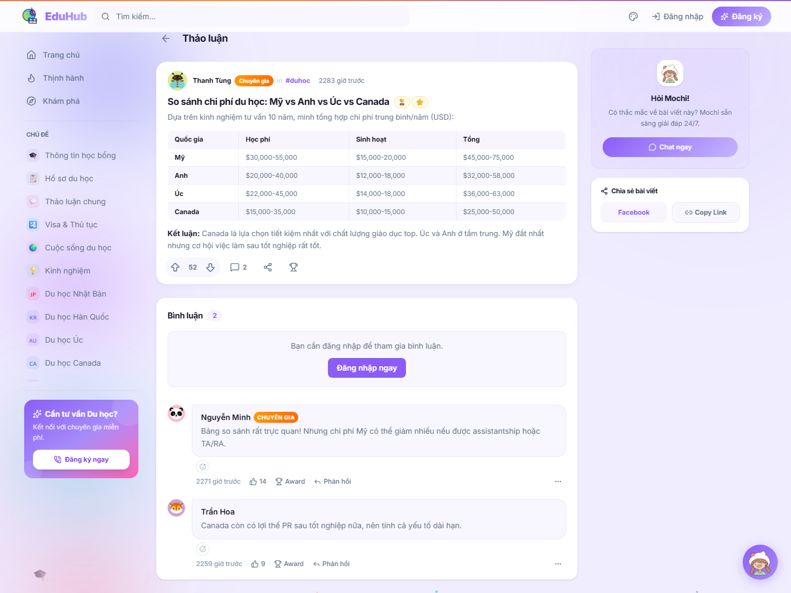

  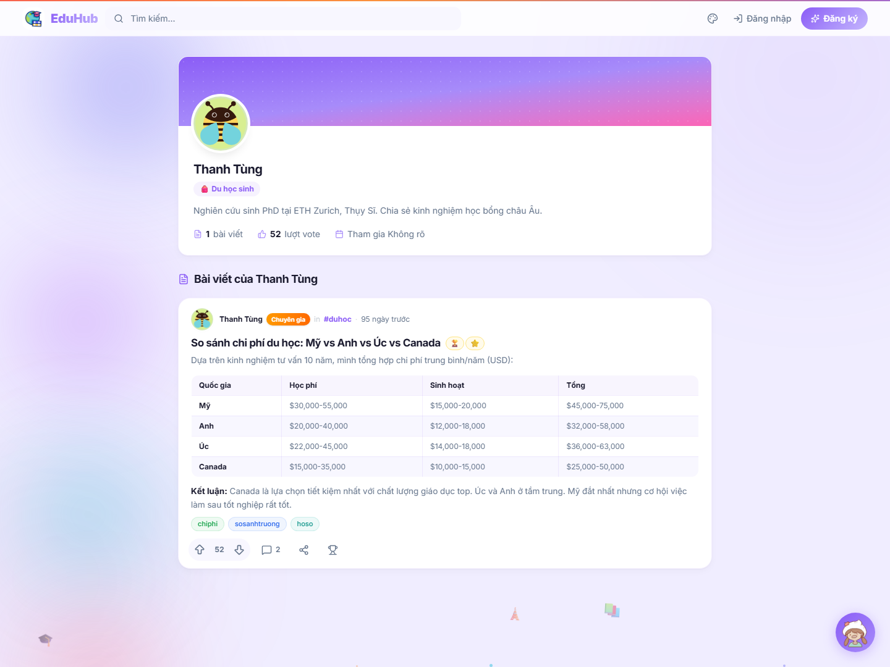

### Admin System

  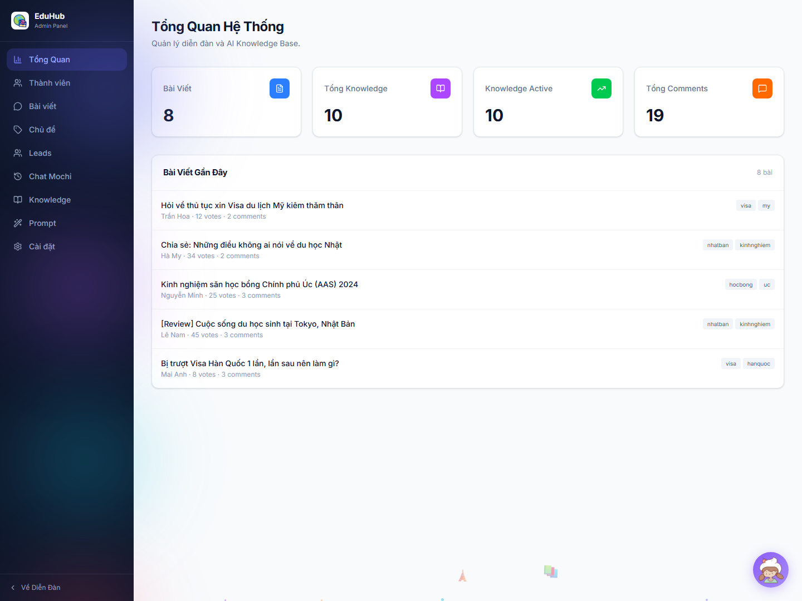
  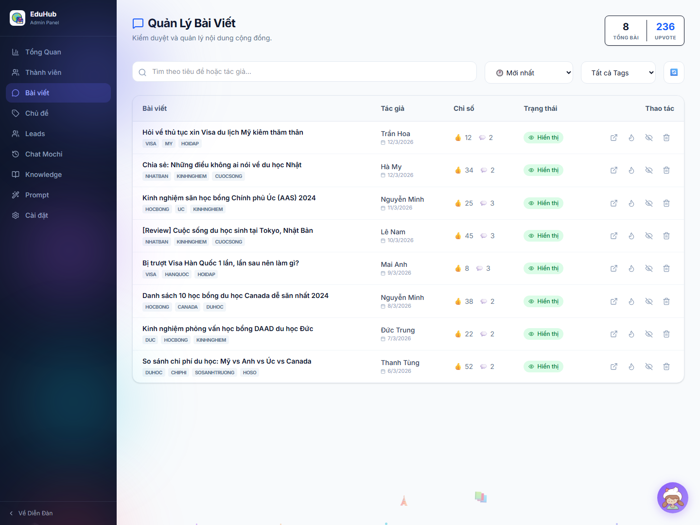
  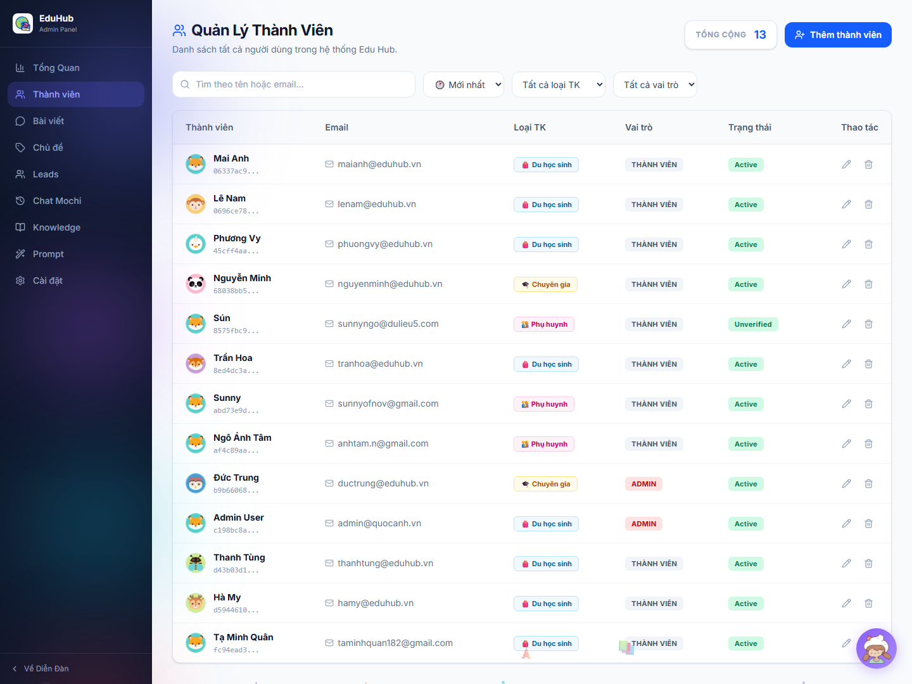

  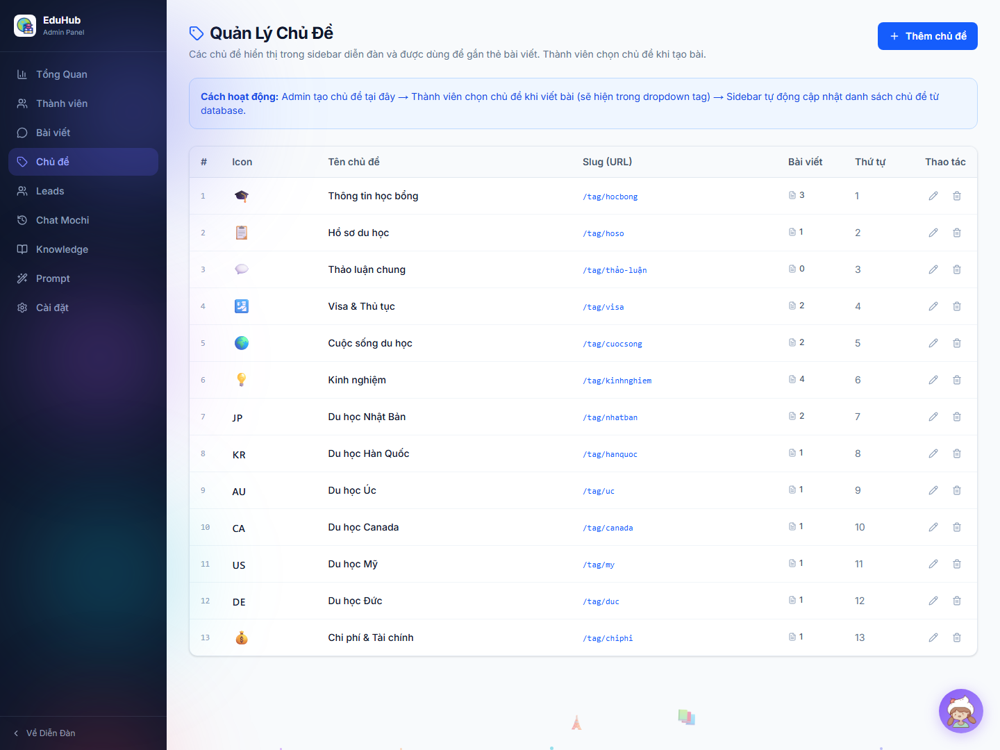
  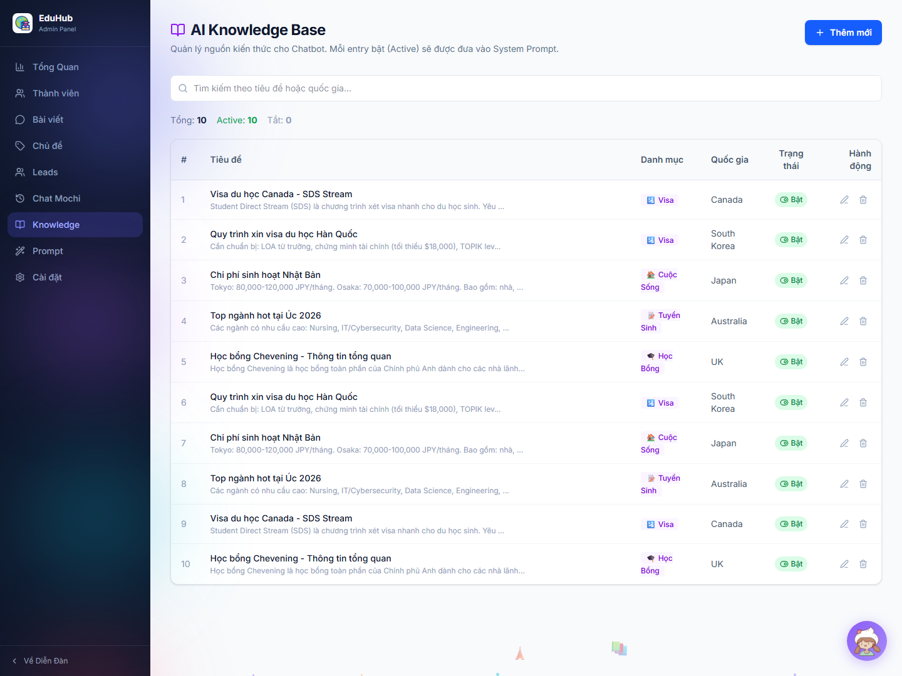
  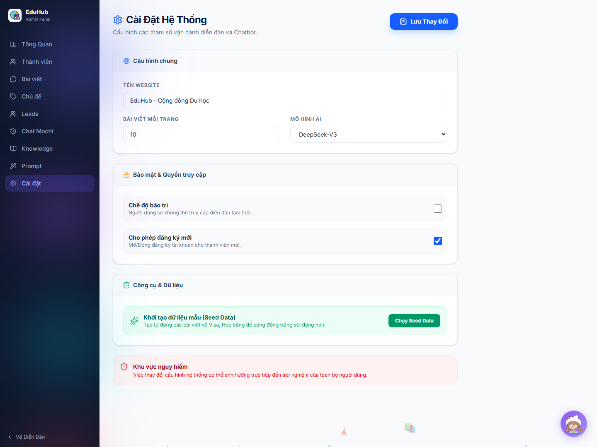

## Public-Side Product Shape

EduHub gives users a softer entry point into study-abroad research:

- Homepage And Feed Discovery.
- Login And Member Participation.
- Community Posts, Topic Browsing, And Post-Level Discussions.
- Member Profile Pages And Contributor Identity.
- AI-Assisted Question Flow.
- Organic Trust-Building Before Consultation.

## Admin-Side Product Shape

EduHub also includes a real operator surface behind the public experience:

- System Dashboard With Core Counts.
- Post Review And Moderation Workflow.
- User Oversight And Access Review.
- Topic And Structure Management.
- AI Knowledge Base Management.
- System Settings And Operator Controls.
- Member And Community Oversight.
- Lead Intake And Follow-Up Handling.

That matters because the product is not only a front-facing content layer. It is also an operating surface for the team behind it.

## Who It Is For

- Students researching countries, schools, scholarships, and visa routes.
- Parents who need clearer signals and less chaotic information.
- Education teams that want a more structured community and lead workflow.
- Operators who need public engagement connected to admin execution.

## Why It Exists

EduHub is not just a blog and not just a chatbot.

It exists to solve a more practical problem:

> "People need a lower-pressure and more trustworthy way to explore study-abroad questions before they are ready for direct consulting."

That is why the product feels useful on both sides:

- helpful for the user,
- operational for the team behind it.

## Why People Remember It

- It Feels More Helpful Than Aggressive.
- It Combines Community Trust With AI Speed.
- It Connects Public Discovery To Admin Execution.
- It Makes The Journey From Curiosity To Consultation More Structured.

## Product Boundaries

### Included now

- Public Homepage And Feed.
- Login And Signed-In Community Flow.
- Community Posting, Reading, And Comment-Thread Experience.
- Member Profile Surface.
- AI Assistance Layer.
- Admin Dashboard.
- Admin Post Management.
- Admin Users, Topics, Knowledge, And Settings Surfaces.

### Important caveats

- EduHub is not an open-source forum product.
- This repository is not the source or deployment repository.
- Some admin capabilities depend on configured backend services.
- AI-assisted responses still require operator review discipline.

## Privacy Model

EduHub is a hosted web product, not a local-first desktop app.

At a high level:

- Public visitors can browse community content.
- Logged-in users can participate more deeply.
- AI or consultation flows may collect contact details when the user chooses to provide them.
- Admin-side tools may process moderation data, posts, and lead-related information.

See [docs/PRIVACY.md](docs/PRIVACY.md) for the short public privacy summary.

## Availability

- Public Site: https://eduhub.alphabot.vn/
- Admin Surface: https://eduhub.alphabot.vn/admin
- Product Type: hosted web community and admin system
- Current State: public-facing community with integrated operator workflow

## 3-Step Getting Started

1. **Browse** the live site to understand the public experience.
2. **Review** the screenshots here to see both user-side and admin-side surfaces.
3. **Use** the support path for product questions or operator contact.

## Start Here

- `Live Site`: https://eduhub.alphabot.vn/
- `Admin Surface`: https://eduhub.alphabot.vn/admin
- `Support`: [SUPPORT.md](SUPPORT.md)
- `FAQ`: [docs/FAQ.md](docs/FAQ.md)
- `Roadmap`: [docs/ROADMAP.md](docs/ROADMAP.md)

## Support

- Email: `admin@quocanh.vn`

## Explore EduHub

  <strong>Want to see how public community discovery and admin-side operations work together in one study-abroad product?</strong> 
  Start with the live site, then review the visual tour and public docs in this repository.

  <a href="https://eduhub.alphabot.vn/"><strong>Open Live Site</strong></a>
  |
  <a href="https://eduhub.alphabot.vn/admin"><strong>Open Admin Surface</strong></a>

## Closed-Source Notice

EduHub is a closed-source web product by Quoc Anh / AlphaBot.

This repository exists to:

- Explain The Product.
- Show Current Product Shape.
- Publish Screenshots And Public Docs.
- Provide Support And Security Contact Paths.

It does not include:

- Application Source Code.
- Private Backend Or Deployment Code.
- Admin Credentials.
- Secret Infrastructure Or Keys.
- User Or Community Data.

## Repository Scope

This repo should stay limited to public-facing material:

- Product Overview.
- Screenshots.
- FAQ.
- Privacy Summary.
- Roadmap.
- Support And Security Contacts.
