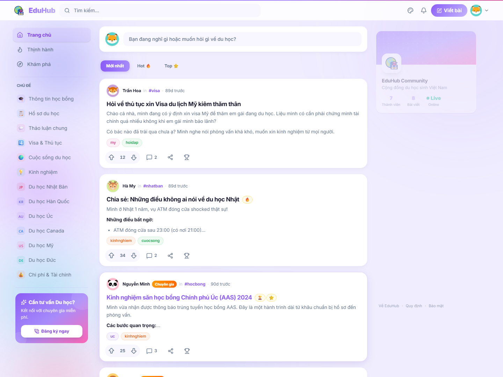
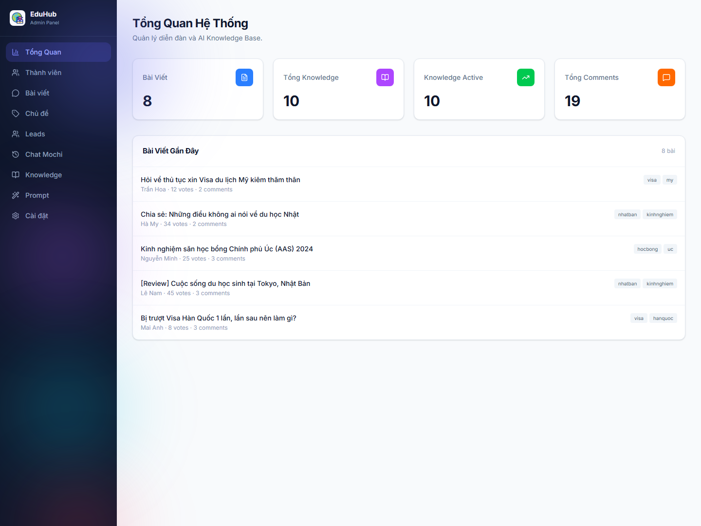
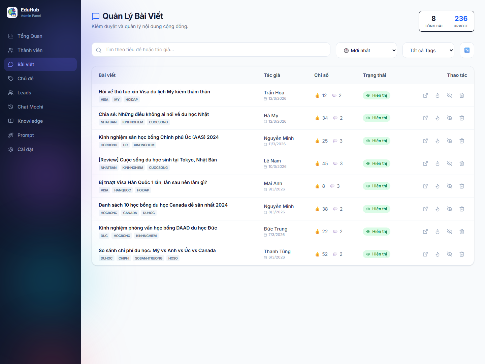

# EduHub

  

  <strong>Nền tảng cộng đồng du học kết hợp AI hỗ trợ và lớp vận hành quản trị phía sau.</strong>

  EduHub giúp học sinh và phụ huynh tiếp cận thông tin du học theo cách mềm hơn, đáng tin hơn,
  trước khi đi vào một cuộc trao đổi tư vấn trực tiếp.

  
  
  
  

  <a href="README.md"><strong>Read in English</strong></a> |
  <strong>Đọc bằng tiếng Việt</strong>

  <a href="https://eduhub.alphabot.vn/"><strong>Live Site</strong></a>
  |
  <a href="SUPPORT.md"><strong>Hỗ trợ</strong></a>
  |
  <a href="docs/FAQ.md"><strong>FAQ</strong></a>

## Cú Chuyển Lớn

Phần lớn marketing du học vẫn bắt đầu quá sớm bằng bán hàng:

- Ép người dùng vào tư vấn,
- Xin thông tin liên hệ quá sớm,
- Đưa thông tin rời rạc và thiếu ngữ cảnh,
- Làm mất niềm tin trước khi cuộc trò chuyện thực sự bắt đầu.

EduHub đổi luồng đó.

Người dùng có thể khám phá feed cộng đồng, đọc chủ đề thật, tìm kiếm thảo luận cũ, hỏi AI hỗ trợ,
và chỉ đi vào luồng lead hoặc tư vấn khi họ thực sự sẵn sàng.

Điểm "wow" không chỉ là có diễn đàn.  
Điểm "wow" là cộng đồng, AI và lớp vận hành admin được nối với nhau trong cùng một sản phẩm.

> Từ những câu hỏi du học rời rạc sang một hành trình ra quyết định có cộng đồng đứng sau.

## Vì Sao Trải Nghiệm Này Khác

1. **Khám phá** nội dung hữu ích mà không bị tạo áp lực bán hàng ngay.
2. **Hỏi đáp** qua cộng đồng và lớp AI hỗ trợ.
3. **Chuyển đổi** nhu cầu nghiêm túc thành một workflow lead rõ ràng phía admin.

Repository này là hub public để giới thiệu sản phẩm và hỗ trợ cho EduHub. Nó không chứa source code của ứng dụng.

## Bạn Nhận Được Gì

- `💬` Trải nghiệm cộng đồng để hỏi và đọc về visa, học bổng, quốc gia, trường và đời sống du học
- `🤖` Lớp AI hỗ trợ trả lời nhanh và gợi mở luồng tư vấn khi phù hợp
- `🧭` Cơ chế khám phá theo topic và nội dung thảo luận thực tế
- `🛠️` Lớp quản trị cho moderation, users, posts, leads, settings và chat review
- `📈` Một mô hình sản phẩm kết nối trust từ phía người dùng với workflow vận hành phía sau

## Nhìn Nhanh

- `🌐` Nền tảng web hosted
- `🎓` Dành cho học sinh, phụ huynh và đội ngũ giáo dục
- `🧩` Cộng đồng + chatbot + admin workflow
- `🔐` Có lớp admin được kiểm soát truy cập
- `📬` Có flow thu lead và follow-up
- `📱` Có trải nghiệm public browse, login và tham gia cộng đồng

## Xem Nhanh Giao Diện

  
  
  

## Dành Cho Ai

- `🎓` Học sinh đang tìm hiểu quốc gia, trường, học bổng và visa
- `👨‍👩‍👧` Phụ huynh cần tín hiệu rõ ràng hơn giữa một thị trường nhiều thông tin nhiễu
- `🧑‍💼` Đội ngũ giáo dục cần lớp lead và moderation rõ ràng hơn
- `🗂️` Người vận hành muốn nối hành vi public với workflow xử lý phía sau

## EduHub Làm Được Gì

- Cung cấp feed cộng đồng cho thảo luận du học
- Hỗ trợ login, tham gia và tương tác nội dung
- Thêm lớp chatbot AI cho hỏi đáp và handoff
- Cung cấp lớp admin cho users, posts, topics, leads, settings và chat history
- Nối discovery phía public với workflow phía admin

## Vì Sao Sản Phẩm Này Tồn Tại

EduHub không chỉ là blog và cũng không chỉ là chatbot.

Nó tồn tại để giải bài toán thực tế hơn:

> "Người dùng cần một cách tiếp cận du học ít áp lực hơn, đáng tin hơn, trước khi sẵn sàng bước vào tư vấn trực tiếp."

Điều đó khiến sản phẩm có ích cho cả người dùng lẫn đội ngũ vận hành phía sau.

## Vì Sao Người Dùng Nhớ Nó

- `✨` Vì trải nghiệm mang tính hỗ trợ hơn là thúc ép
- `🧠` Vì nó kết hợp trust của cộng đồng với tốc độ của AI
- `🏗️` Vì nó nối thảo luận public với lớp vận hành admin
- `💡` Vì nó tạo cầu nối tốt hơn từ tò mò sang tư vấn thật sự

## Phạm Vi Sản Phẩm

### Đã có sẵn

- Feed cộng đồng public
- Cơ chế thảo luận theo topic và tag
- Login và luồng tham gia của thành viên
- Chatbot AI cho hỏi đáp du học
- Dashboard admin
- Admin users, posts, topics, leads, settings và chat-history
- Lead capture và workflow follow-up

### Lưu ý quan trọng

- EduHub không phải diễn đàn open-source
- Repository này không phải repo source hay repo deploy
- Một số năng lực phía admin phụ thuộc vào backend services đã được cấu hình
- AI responses vẫn cần scope discipline và chuẩn review vận hành

## Mô Hình Riêng Tư

EduHub là ứng dụng web hosted, không phải sản phẩm local-first.

Luồng dữ liệu ở mức high-level:

- Khách public có thể browse nội dung cộng đồng
- Thành viên đăng ký có thể tham gia sâu hơn tùy flow và quyền
- Chatbot hoặc consultation flow có thể thu thông tin liên hệ khi người dùng chủ động cung cấp
- Lớp admin có thể xử lý lead, chat summary và dữ liệu moderation

Xem [docs/PRIVACY.md](docs/PRIVACY.md) để biết bản tóm tắt public.

## Các Bề Mặt Sản Phẩm

- Public community: homepage, posts, search, profile, login/register
- AI layer: chatbot-assisted Q&A và guided handoff
- Admin layer: dashboard, users, posts, topics, leads, settings và chat review

## Availability

- Live site: https://eduhub.alphabot.vn/
- Product type: hosted web community + admin system
- Current state: public-facing community với operator workflow tích hợp

## Bắt Đầu Trong 3 Bước

1. **Khám phá** site live để xem topic, cộng đồng và cách nội dung vận hành.
2. **Hiểu sản phẩm** qua repo public, screenshot và docs.
3. **Sử dụng** live site và support path khi cần hỏi thêm về sản phẩm hoặc vận hành.

## Bắt Đầu Từ Đây

- `🌐` Live site: https://eduhub.alphabot.vn/
- `🛟` Hướng dẫn hỗ trợ: [SUPPORT.md](SUPPORT.md)
- `❓` FAQ: [docs/FAQ.md](docs/FAQ.md)
- `🗺️` Roadmap: [docs/ROADMAP.md](docs/ROADMAP.md)

## Hỗ Trợ

- Email: `admin@quocanh.vn`

## Khám Phá EduHub

  <strong>Muốn xem cách cộng đồng, AI hỗ trợ và workflow admin kết hợp trong cùng một sản phẩm?</strong> 
  Hãy vào site live trước, rồi dùng support path khi cần trao đổi sâu hơn về sản phẩm hoặc vận hành.

  <a href="https://eduhub.alphabot.vn/"><strong>Mở Live Site</strong></a>
  |
  <a href="SUPPORT.md"><strong>Liên hệ hỗ trợ</strong></a>

## Lưu Ý Closed-Source

EduHub là sản phẩm web closed-source của Quoc Anh / AlphaBot.

Repository này tồn tại để:

- giải thích sản phẩm
- cho thấy năng lực hiện tại
- công bố screenshot và tài liệu public
- cung cấp đầu mối hỗ trợ và security contact

Nó không bao gồm:

- source code ứng dụng
- private backend hoặc deployment code
- admin credentials
- secret infrastructure hoặc keys
- user/community data

## Phạm Vi Repository

Repo này chỉ nên chứa:

- product overview
- FAQ
- privacy summary
- roadmap
- support/security contacts
- screenshots

Nếu sau này có release flow hoặc public documentation site riêng, phần đó nên được document rõ thay vì để người xem tự suy diễn từ repo này.
